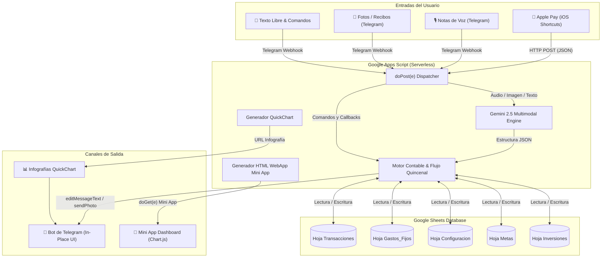

# 🏦 Personal Finance CFO & Autonomous AI Agent 🤖💎

[](https://developers.google.com/apps-script)
[](https://core.telegram.org/bots)
[](https://ai.google.dev/)
[](https://www.google.com/sheets/about/)
[](https://opensource.org/licenses/MIT)

Un sistema autónomo integral de finanzas personales, asistente CFO privado y guardián patrimonial impulsado por inteligencia artificial. Diseñado para ejecutarse 100% *serverless* en **Google Apps Script**, utilizando **Google Sheets** como base de datos en tiempo real, **Telegram** como interfaz de usuario conversacional y **Google Gemini 2.5** para comprensión multimodal de audios, fotos de comprobantes bancarios y consultas de psicología del gasto.

---

## 📑 Tabla de Contenidos
- [Características Principales](#-características-principales)
- [Arquitectura del Sistema](#-arquitectura-del-sistema)
- [Metodología de Bolsillos y Asignación (53% / 27% / 20%)](#-metodología-de-bolsillos-y-asignación-53--27--20)
- [Estructura de la Base de Datos (Google Sheets)](#-estructura-de-la-base-de-datos-google-sheets)
- [Guía de Instalación y Despliegue](#-guía-de-instalación-y-despliegue)
  - [1. Requisitos Previos](#1-requisitos-previos)
  - [2. Configuración de Google Sheets](#2-configuración-de-google-sheets)
  - [3. Despliegue del Código en Google Apps Script](#3-despliegue-del-código-en-google-apps-script)
  - [4. Configuración de Variables de Entorno (Script Properties)](#4-configuración-de-variables-de-entorno-script-properties)
  - [5. Publicación de la WebApp y Registro del Webhook](#5-publicación-de-la-webapp-y-registro-del-webhook)
  - [6. Integración con Apple Pay (iOS Shortcuts)](#6-integración-con-apple-pay-ios-shortcuts)
- [Referencia Completa de Comandos](#-referencia-completa-de-comandos)
- [Seguridad y Privacidad](#-seguridad-y-privacidad)
- [Licencia](#-licencia)

---

## ✨ Características Principales

### 1. Ingesta Multimodal de Transacciones en Tiempo Real
* **Apple Pay / iOS Shortcuts:** Captura instantánea de compras físicas y online mediante un atajo automatizado en iPhone que envía el payload JSON a la WebApp.
* **Notas de Voz y Audios de Telegram:** Envía notas de voz como *"Me compré un café en Juan Valdez por 8.500 con tarjeta"* o *"Pasé 200 mil al ahorro"*. Gemini transcribe el audio, extrae el monto, detecta si es gasto, ingreso o traslado interno y clasifica la categoría.
* **Fotos de Comprobantes Bancarios:** Envía capturas de pantalla de transferencias (Nequi, Davivienda, Bancolombia, Nu). Gemini Vision lee la imagen con OCR multimodal, extrae el comercio/destinatario y el valor exacto.
* **Mensajes de Texto y Comandos:** Soporte para lenguaje natural (*"Almorcé por 25k"*) o comandos directos (`/gasto 25000 Almuerzo`).

### 2. Guardián Patrimonial & Asesor CFO Privado
* **Fricción Anti-Impulso y Psicología Financiera:** Antes de comprar algo no esencial, consúltale al bot en Telegram (*"¿Me compro unos tenis de 250k?"*). El bot evalúa tu saldo disponible, días faltantes para la nómina y **traduce el precio a horas reales de trabajo laboral** y días consumidos de tu presupuesto de ocio diario.
* **Calculadora Anti-Cuotas (`/cuotas`):** Simula compras con tarjeta de crédito demostrando con exactitud cuánto dinero se regalaría al banco en intereses y cuántas horas de trabajo costaría diferir a 3, 6, 12 o 24 meses. Promueve la regla de oro de compras siempre a **1 cuota (0% interés)**.
* **Radar Hormiga y Detección de Fugas (`/radar`):** Detecta microgastos repetitivos (< $20.000 COP) y calcula el acumulado mensual y el tiempo de vida dedicado a fugas de capital.

### 3. Telegram Mini App (Dashboard Web Móvil Nativo)
* **Dashboard Interactivo en Modo Oscuro:** Botón `📱 Abrir Dashboard Web` integrado en el teclado de Telegram que abre una WebApp flotante construida con HTML5 y Chart.js.
* **Visualizaciones:** Gráficos *doughnut* de la distribución patrimonial, tarjetas de liquidez, cronograma de vencimientos fijos y simulador interactivo de rendimientos de CDTs con control deslizante (*slider*).

### 4. Navegación Dinámica en un Solo Mensaje (*In-Place Navigation*)
* Navegación fluida e instantánea: tocar botones interactivos actualiza el contenido y los teclados en el **mismo mensaje existente** (`editMessageText`), eliminando el spam de mensajes en el chat.
* Transiciones inteligentes entre texto y fotos (`editMessageMedia` y gestión de sustitución limpia con `deleteMessage`).

### 5. Infografías Visuales en Modo Oscuro
* Tarjetas de infografía generadas al vuelo con **QuickChart.io**:
  - `📊 Gráfico de Bolsillos`: Donut patrimonial con saldos en vivo.
  - `📊 Gráfico de Gastos`: Gráfico de barras horizontales con el consumo por categoría.

### 6. Scorecard de Cierre de Mes y Calificación de Auditoría (`/cierre_mes`)
* Al finalizar el mes, audita el cumplimiento del ahorro, el control de compromisos fijos y los gastos hormiga, asignando una calificación patrimonial (A+, A, B, C) con veredicto personalizado.

---

## 🏗️ Arquitectura del Sistema



---

## 💎 Metodología de Bolsillos y Asignación (53% / 27% / 20%)

El sistema implementa una arquitectura financiera basada en la regla de **1 débito mensual automático por bolsillo** para entidades financieras como Davivienda o cuentas con bolsillos virtuales:

| Bolsillo | % Meta Mensual | Función y Reglas de Fondeo |
| :--- | :---: | :--- |
| **💎 Bolsillo Ahorro Puro** | **53.0%** | **Blindado e Intocable.** Fondeo mensual automático en la 2ª quincena (día 30). Su propósito es acumular patrimonio, fondo de emergencia e inversión (CDTs / Cripto DCA). |
| **🛡️ Bolsillo Obligaciones Fijas** | **27.0%** | **Gastos Comprometidos.** Fondeo mensual automático en la 1ª quincena (día 15). De aquí se cubren los pagos ineludibles: Arriendo (día 30), Factura Tarjeta de Crédito (día 11), telefonía, suscripciones fijas y gasolina. |
| **🛒 Saldo Disponible en Cuenta** | **20.0%** | **Ocio, Salidas y Gastos Variables.** Dinero libre para alimentación, salidas y diversión. El bot calcula dinámicamente un **Cupo Diario Seguro** ($/día) para garantizar que el saldo alcance con holgura hasta la siguiente quincena. |

> [!IMPORTANT]
> **Porcentajes en Tiempo Real:** El bot distingue con rigor entre la **meta mensual de nómina (53/27/20)** y la **distribución en tiempo real de tus saldos actuales**. Siempre muestra el porcentaje real que cada bolsillo representa sobre tu saldo consolidado en ese momento.

---

## 📊 Estructura de la Base de Datos (Google Sheets)

El archivo de Google Sheets se estructura en 5 pestañas:

1. **`Transacciones`**:
   - Columnas: `Fecha` | `Tipo` (🔴 Gasto / 🟢 Ingreso / 🔄 Traslado) | `Comercio` | `Monto` | `Medio` | `Categoría` | `ID_Transaccion` | `Notas`
2. **`Gastos_Fijos`**:
   - Columnas: `Concepto` | `Monto` | `DiaPago` | `Medio` | `Tipo` (Mensual / Anual)
3. **`Configuracion`**:
   - Pares Clave-Valor: `salario`, `presupuesto_variable`, `saldo_cuenta`, `saldo_bolsillo_ahorro`, `saldo_bolsillo_obligaciones`, `saldo_total_banco`, `deuda_tarjeta_nu`, `dia_pago_tarjeta`, `dia_pago_arriendo`, `valor_arriendo`.
4. **`Metas`**:
   - Columnas: `Nombre` | `Objetivo` | `Actual` | `FechaLimite`
5. **`Inversiones`**:
   - Columnas: `Fecha` | `Tipo` (CDT / Cripto / Acciones) | `Entidad` | `Monto_Invertido` | `Tasa_Precio` | `Plazo_Dias` | `Fecha_Vencimiento` | `Rendimiento_Estimado` | `Estado`

---

## 🚀 Guía de Instalación y Despliegue

### 1. Requisitos Previos
* Una cuenta de **Google** (para Google Sheets y Google Apps Script).
* Una cuenta de **Telegram**.
* Una API Key gratuita de **Google Gemini** obtenida en [Google AI Studio](https://aistudio.google.com/).
* Opcional: **Node.js** y `@google/clasp` instalados localmente si deseas desplegar desde tu terminal.

### 2. Configuración de Google Sheets
1. Crea una nueva hoja de cálculo en [Google Sheets](https://sheets.new).
2. Nómbrala, por ejemplo, `Finanzas_Personales_CFO`.
3. Ve a `Extensiones` -> `Apps Script`.

### 3. Despliegue del Código en Google Apps Script
#### Opción A: Mediante la interfaz web de Apps Script
1. En el editor de Apps Script, abre el archivo `Código.gs` (o `Codigo.js`).
2. Pega todo el contenido de [`Codigo.js`](Codigo.js) de este repositorio.
3. Abre `appsscript.json` (puedes habilitarlo en `Configuración del proyecto` -> *Mostrar archivo de manifiesto "appsscript.json" en el editor*) y copia el contenido de [`appsscript.json`](appsscript.json).
4. Guarda los cambios (`Ctrl + S` o `Cmd + S`).

#### Opción B: Mediante Clasp (CLI)
```bash
# 1. Clona este repositorio
git clone https://github.com/NotProgram/personal-finance-cfo.git
cd personal-finance-cfo

# 2. Inicia sesión en Google Clasp
npx @google/clasp login

# 3. Crea o vincula tu proyecto Apps Script
npx @google/clasp create --title "Personal Finance CFO" --type sheets
# O vincula uno existente: npx @google/clasp clone <SCRIPT_ID>

# 4. Sube el código
npx @google/clasp push
```

### 4. Configuración de Variables de Entorno (Script Properties)
En el editor de Apps Script, ve a **Configuración del proyecto** (ícono de engranaje ⚙️) -> **Propiedades de la secuencia de comandos** (*Script Properties*) y agrega las siguientes claves:

| Propiedad | Descripción | Ejemplo / Formato |
| :--- | :--- | :--- |
| `TELEGRAM_TOKEN` | Token del bot provisto por BotFather | `123456789:AAEXT...` |
| `TELEGRAM_CHAT_ID` | Tu ID numérico de Telegram (para autorizar únicamente tus mensajes) | `123456789` |
| `GEMINI_API_KEY` | Llave de API de Google AI Studio | `AIzaSy_TU_LLAVE_AQUI` |
| `WEB_APP_URL` | URL de despliegue de Apps Script (generada en el siguiente paso) | `https://script.google.com/macros/s/.../exec?view=webapp` |
| `NOMBRE_USUARIO` | (Opcional) Tu nombre para los informes personalizados | `MiNombre` |
| `EMPRESA` | (Opcional) Nombre de tu empresa empleadora | `MiEmpresa S.A.S.` |
| `SUELDO_BASICO` | (Opcional) Salario básico mensual pactado | `3200000` |
| `QUINCENA_15_NETO`| (Opcional) Neto recibido en quincena 1 | `1472000` |
| `QUINCENA_30_NETO`| (Opcional) Neto recibido en quincena 2 | `1721095` |

### 5. Publicación de la WebApp y Registro del Webhook
1. En el editor de Apps Script, haz clic en **Implementar** (*Deploy*) -> **Nueva implementación**.
2. Selecciona tipo **Aplicación web**:
   - **Descripción:** `Producción v1`
   - **Ejecutar como:** `Yo (tu_correo@gmail.com)`
   - **Quién tiene acceso:** `Cualquier usuario (incluso anónimos)` *(necesario para que Telegram y Apple Pay envíen webhooks).*
3. Copia la **URL de la aplicación web** resultante.
4. Actualiza la propiedad `WEB_APP_URL` en *Script Properties* con esta URL (añadiendo `?view=webapp` al final).
5. En el menú de funciones de Apps Script, selecciona y ejecuta la función `registrarWebhookTelegram()`.
6. En los registros verás: `Resultado de registro de Webhook Telegram: {"ok":true,"result":true,"description":"Webhook was set"}`.
7. Opcional: ejecuta `configurarTriggersAutomaticos()` para activar las alertas matutinas automáticas a las 8:00 AM.

### 6. Integración con Apple Pay (iOS Shortcuts)
Para registrar gastos con Apple Pay de forma automática en tu iPhone:
1. Abre la app **Atajos** (*Shortcuts*) en iOS -> pestaña **Automatización**.
2. Crear nueva automatización: **Al pagar con Apple Pay** -> Selecciona cualquier tarjeta.
3. Agrega la acción **Obtener contenido de URL** (*URL Fetch*):
   - **URL:** La URL de tu aplicación web de Apps Script.
   - **Método:** `POST`
   - **Cuerpo de la solicitud:** `JSON` con los siguientes campos del evento Apple Pay:
     ```json
     {
       "comercio": "Nombre de la tienda / comercio",
       "monto": 25000,
       "medio": "Tarjeta Davivienda / Nu"
     }
     ```
4. Desactiva *"Preguntar antes de ejecutar"* y activa *"Notificar al ejecutarse"*.

---

## 📖 Referencia Completa de Comandos

| Comando | Descripción |
| :--- | :--- |
| `/start` o `/menu` | Despliega el menú principal interactivo y activa el teclado de accesos rápidos. |
| `/saldo` | Liquidez en vivo: Disponible, Bolsillo Ahorro, Bolsillo Obligaciones y Saldo Total consolidado. |
| `/bolsillos` | Estado detallado de bolsillos, porcentajes en tiempo real y reglas de débito de nómina. |
| `/quincena` o `/nomina` | Calendario quincenal, días faltantes para el cobro, compromisos de la quincena y cupo diario seguro. |
| `/cobro_quincena` | Acredita el ingreso de nómina recibido y distribuye automáticamente en bolsillos según el modelo. |
| `/fijos` | Lista de compromisos mensuales fijos con fechas de vencimiento y medios de pago. |
| `/deuda` o `/tarjeta` | Estado de factura de la Tarjeta de Crédito Nu, fecha límite de pago (los 11) y cobertura en Obligaciones. |
| `/set_deuda [monto]` | Actualiza manualmente el valor a pagar de la factura de tarjeta (`/set_deuda 159000`). |
| `/pagar_tarjeta` | Registra el pago total de la tarjeta debitándolo del Bolsillo de Obligaciones. |
| `/cuotas [monto] [ctas]` | **Calculadora Anti-Cuotas:** Simula el interés bancario y las horas de trabajo laboral que costaría diferir. |
| `/reporte` o `/resumen` | Resumen mensual de gastos variables, barras de consumo y desglose de categorías en monospace. |
| `/radar` | Radar financiero de fugas y compras hormiga (< $20.000 COP). |
| `/metas` | Seguimiento visual de metas de ahorro con barras de progreso de alto contraste. |
| `/nueva_meta [nom] [monto]` | Crea una nueva meta de ahorro (`/nueva_meta Fondo Emergencia 5000000`). |
| `/abono [nom] [monto]` | Registra un abono de ahorro a una meta existente (`/abono Fondo 100000`). |
| `/traslado [bolsillo] [monto]`| Mueve dinero desde Disponible hacia Ahorro u Obligaciones. |
| `/retirar_bolsillo [bolsillo] [monto]`| Devuelve fondos de un bolsillo hacia el Disponible para gastar. |
| `/invertir` | Hub de inversiones: simulación de CDTs en Colombia, Cripto micro-DCA en Binance y sub-bolsillos. |
| `/cierre_mes` | Scorecard de auditoría patrimonial con calificación mensual (A+, A, B, C) y veredicto del CFO. |
| `/deshacer` | Revierte inmediatamente el último gasto registrado y restaura los saldos bancarios. |

---

## 🔒 Seguridad y Privacidad

1. **Sin Credenciales Expuestas:** El repositorio y el código fuente no contienen API keys, tokens ni datos personales en texto plano; todo se gestiona de forma aislada a través de `PropertiesService.getScriptProperties()`.
2. **Filtro Estricto de Chat ID:** Todas las peticiones recibidas por Telegram validan el `chat_id` del emisor contra `CONFIG.TELEGRAM_CHAT_ID`. Si un usuario desconocido interactúa con el bot, la solicitud es rechazada de inmediato.
3. **Spoilers de Cifras Sensibles:** Los montos de saldos bancarios y deuda se transmiten formateados con etiquetas nativas de Telegram `<tg-spoiler>` (`||$X.XXX.XXX COP||`), protegiendo tus datos financieros de miradas curiosas en lugares públicos.
4. **Infraestructura Privada:** Todos los datos se almacenan exclusivamente en tu propia cuenta de Google Drive / Google Sheets. No existen servidores intermediarios de terceros.

---

## 📄 Licencia

Distribuido bajo la Licencia **MIT**. Consulta el archivo [`LICENSE`](LICENSE) para obtener más información.
